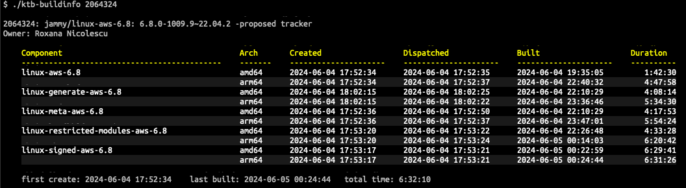
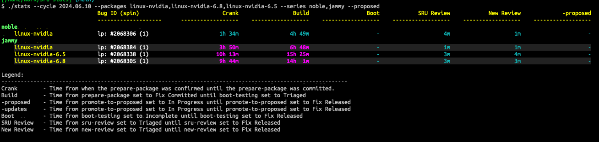
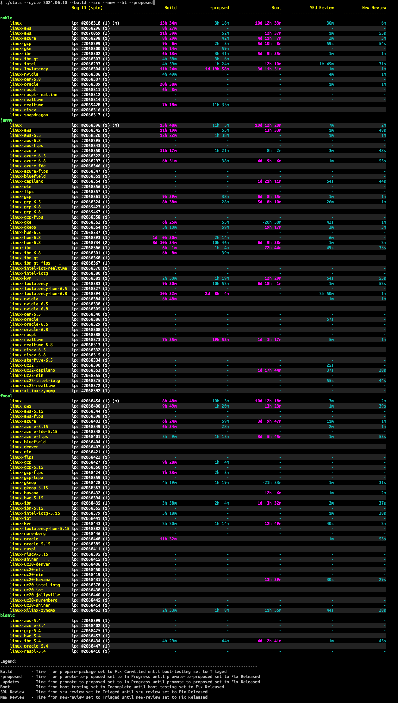

# sru-stats

Ubuntu updates it's supported kernels on a regular interval, a cadence. Today, June 28, 2024,
that cadence is 2 weeks for security fixes and 4 weeks for non-security fixes. For our purposes
here, I'm going to ignore the 2 week security SRU cycles and focus on the 4 week non-security
fixes. Every 4 weeks new Ubuntu kernels are released to the -updates pocket. These updates
contain patches that the upstream Linux community has released as part of their stable update
process. These updates can also contain fixes requested by Ubuntu partners, users, Ubuntu Engineering,
Canonical Support, etc. The schedule for these kernel SRU cycles can be found at
https://kernel.ubuntu.com.

A key component of the kernel SRU process is a Launchpad bug referred to as a kernel tracking bug (KTB).
For each kernel that is going through the SRU cycle there is an accompanying KTB that is filed against a
special project that is unique to KTBs and whos tasks relate to the stages and tasks that the kernel goes
through as it moves from the start of producing a kernel update all the way to releasing that kernel to
the -updates pocket.

The tools in this project are intended to help examine the different stages kernel packages go
through during an SRU cycle with the goal to understand these stages and how long the stages
take with the goal of hopfully, reducing the length of each of these stages.

## Tools

### ktb-history

The KTB's history is pulled from Launchpad, changes to the description are discarded and the focus is
on task status changes. Annotations are added to the output pointing out the beginning and ending of
major stages in the kernel packages progress. The length of those major stages is also provided.

---

### ktb-buildinfo

Using the information in a specific KTB the kernel set components associated with a specific kernel update
are identified and the build information for those components is pulled from Launchpad. The original goal
was to get the exact build times for each component which can be displayed via Launchpad's web interface.
However, I've not been able to do that, instead the information I am able to extract is equally important
as it is showing the total times it takes to build components from when they are submitted until the component
is built. This includes DEPWAIT times I believe.

---

### db-update

Gathers data from tracking bugs and put it into a local database. That database can then be interigated by
using the <bold>stats</bold> utility. This tool can be used to perform a number of operations on the database.
It can be handy to have a database of current and old KTB data so that statistics can be easily queried for
and displayed. Statistics about different kernels of different SRU cycles can be compared.

---

### ls-cycles
Prints out a list of all of the sru cycles the database knows about.

---

### stats

Displays various statistics about the one or more kernels whose data has been captured and stored in the local
database using <bold>db-update</bold>.

