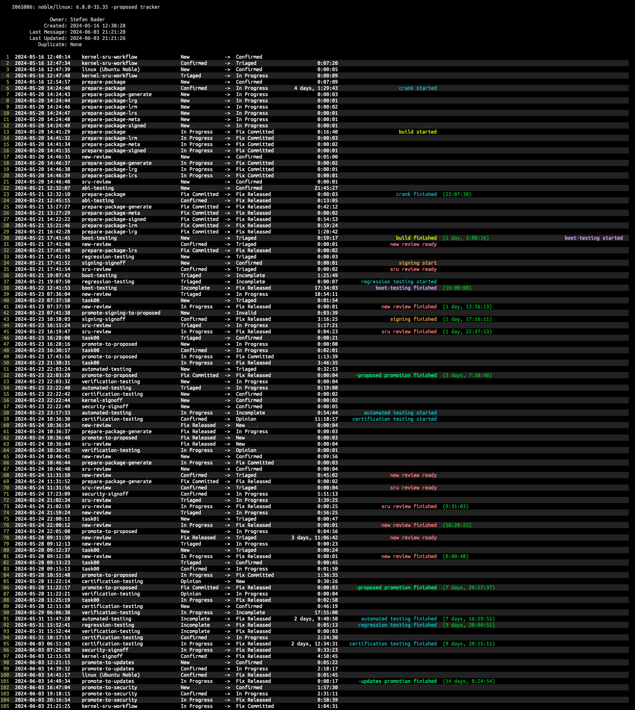

# sru-stats

This project refers to the Ubuntu Kernel SRU Cycle. The idea behind the tools in this project are to gather data about the SRU Cycle process with the goals of understanding how the process is working and where time is spent along the pipeline that is used to produce Ubuntu kernel updates.

## Tools

### lpbug-history
The kernel tracking bug is specified on the command line. The bug's history is pulled from LP and listed along with annotations about the beginning and end of different stages in the process and how long that state took to finish.

---

### lpbug-buildinfo
Display the build times for the different kernel set components.

---

### db-update
Gathers data from tracking bugs and put it into a local database. That database can then be interigated by using the <bold>stats</bold> utility.

---

### ls-cycles
Prints out a list of all of the sru cycles the database knows about.

---

### stats
Displays various statistics about the various kernels whose data has been captured and stored in the local database using <bold>db-update</bold>.

